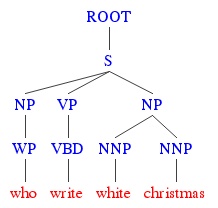
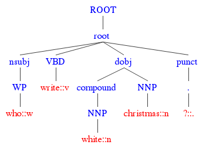
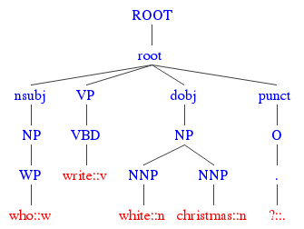
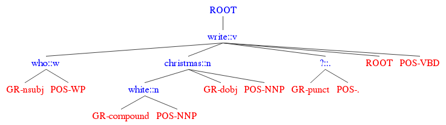

# Installation

## Prerequisites
The tool requires the following prerequisites:
*	Java 1.8+
*	Apache Maven > 3.3.9. Refer to http://maven.apache.org/install.html for the installation instructions
* Python 2.7.x (required by the evaluation script and for reproducing the experiments on cross-pair kernels)

## Installing
```bash
git clone https://github.com/iKernels/RelTextRank.git
```

Run the following command sequence to install the software and set the Java classpath.

```bash
cd ./RelTextRank

export JAVA_HOME=<path to your JDK distribution>

sh scripts/install/install.sh 

rm target/dependency/google-collections-1.0.jar 

export CLASSPATH=${CLASSPATH}:bin/:target/dependency/*:target/classes

mkdir logs
```

### Setting up DKPRO
Additional DKPro resources for computing semantic Wikipedia and WordNet-based DKPro similarity featuress, if required. You do not need to do this, if you are going to generate the structures only following  examples in this readme.
Refer to https://dkpro.github.io/dkpro-similarity/settinguptheresources/ for the instructions on how to setup the following DKPro resources 
(Please, remember to set up the DKPRO_HOME environment variable as described in the installation instructions web-page):
  * **WordNet Lexical Semantic Resource index.**  Follow all the official installation instructions, but substitute the original wordnet_properties.xml file supplied within WordNet resource graph archive, with the following file instead: https://raw.githubusercontent.com/dkpro/dkpro-lsr/master/de.tudarmstadt.ukp.dkpro.lexsemresource.wordnet-asl/src/main/resources/resource/WordNet_3/wordnet_properties.xml.

    We do not employ Wiktionary in the pipeline. Therefore, you need to remove the following lines from the resources.xml file (or, alternatively, you may download and install the Wiktionary resources as described in the DKPro installation instructions):
    ```xml
    <bean id="wiktionary-en" lazy-init="true" class="de.tudarmstadt.ukp.dkpro.lexsemresource.wiktionary.WiktionaryResource">
    <constructor-arg value="ENGLISH"/>
    <constructor-arg value="${DKPRO_HOME}/LexSemResources/Wiktionary/jwktl_0.15.2_en20100403"/>
    </bean>
    ```
    
    Addtionaly:
       * make sure to set up the correct paths to your WordNet resources in  ```${DKPRO_HOME}/LexSemResources/WordNet_3x/wordnet_properties.xml``` (check line 51).
       * check that  that the WordNet entry in ```${DKPRO_HOME}/de.tudarmstadt.ukp.dkpro.lexsemresource.core.ResourceFactory/resources.xml``` looks as follows:
         ```xml
         <bean id="wordnet3-en" lazy-init="true"
                class="de.tudarmstadt.ukp.dkpro.lexsemresource.wordnet.WordNetResource">
                <constructor-arg value="${DKPRO_HOME}/LexSemResources/WordNet_3x/wordnet_properties.xml"/>
         </bean>
         ```
          
 *	**Wikipedia Explicit Semantic Analysis index.** If you want to be able to access to the full range of features available in this pipeline, please, download the precompiled the Wikipedia Explicit Semantic Analysis index (see the Explicit Semantic Analysis: Vector Indexes section of the DKPro installation instructions).

# Reproducing the EMNLP 2018 results
If you want to reproduce the results from our most recent publication
*  Tymoshenko, K. and Moschitti, A. (2018). [Cross-Pair Text Representations for Answer Sentence Selection.](http://aclweb.org/anthology/D18-1240) In EMNLP.

please install the tool as above and follow the instructions at the [wiki page](https://github.com/iKernels/RelTextRank/wiki/Reproducing-the-results-in-the-EMNLP-2018-paper-%22Cross-Pair-Text-Representations-for-Answer-Sentence-Selection%22). 

Note that you need to set up the WordNet Lexical Semantic Resource index and the ```DKPRO_HOME``` environment variable if you wish to reproduce the EMNLP 18 results.
# Running the experiments with structural representations

You can use the tool to build the structures employed in the following papers:

* Tymoshenko, K., Bonadiman, D., Moschitti, A. (2017). [Ranking Kernels for Structures and Embeddings: A Hybrid Preference and Classification Model.](http://aclweb.org/anthology/D17-1093) In EMNLP. 

* Tymoshenko, K., Moschitti, A. (2015). [Assessing the impact of syntactic and semantic structures for answer passages reranking.](https://doi.org/10.1145/2806416.2806490) In CIKM. 

* Tymoshenko, K., Moschitti, A., Nicosia, M.,  Severyn, A. (2017). [RelTextRank: An Open Source Framework for Building Relational Syntactic-Semantic Text Pair Representations.](http://www.aclweb.org/anthology/P17-4014) In ACL, System Demonstrations.

* Tymoshenko, K., Bonadiman, D., & Moschitti, A. (2016). [Learning to rank non-factoid answers: Comment selection in Web forums.](https://doi.org/10.1145/2983323.2983906) In CIKM. 

* Tymoshenko, K., Bonadiman, D., & Moschitti, A. (2016). [Convolutional neural networks vs. convolution kernels: Feature engineering for answer sentence reranking](http://www.aclweb.org/anthology/N16-1152). In NAACL HLT.

*(Note, that the results might slightly differ from the results reported in the above works due to some minor changes in the code).*

We show how to run the experiments on the example of the WikiQA dataset.

## Downloading the WikiQA dataset
First, you need to download the WikiQA data from https://www.microsoft.com/en-us/download/details.aspx?id=52419. 
Then run the following commands from the root of the RelTextRank distribution.

```bash
export wikiqa_location=<folder to which you unpacked the WikiQa distribution>
mkdir data/wikiQA
python scripts/converters/wikiqa_convert.py ${wikiqa_location}/WikiQA-train.tsv data/wikiQA/WikiQA-train.questions.txt  data/wikiQA/WikiQA-train.tsv.resultset
python scripts/converters/wikiqa_convert.py ${wikiqa_location}/WikiQA-test.tsv data/wikiQA/WikiQA-test.questions.txt  data/wikiQA/WikiQA-test.tsv.resultset
python scripts/converters/wikiqa_convert.py ${wikiqa_location}/WikiQA-dev.tsv data/wikiQA/WikiQA-dev.questions.txt  data/wikiQA/WikiQA-dev.tsv.resultset
```

It may take a long time to train the pipeline on the full-scale data on a single machine. If you wish to train on the subset of data,
run the following command to prepare the input file with the 

input data:
```bash
python scripts/converters/extract_trainset_subset.py -i data/wikiQA/WikiQA-train.questions.txt -o  data/wikiQA/WikiQA-train.questions.toy.txt -p 0.3
```

## Running experiments with a conveniency script

We provide a conveniency python script which generates a shell script which runs the end-to-end experiment in a specific configuration:

```bash 
python scripts/experiment_launchers/experiment_launcher.py  
```

Below you may find examples of the commands to generate the shell scripts which will run end-to-end experiments with different structural representations and the Partial Tree Kernel SVM on WikiQA.

First, you need to set the ```corpus_name``` environment variable.

To train on full-scale data (will take time):
```bash
export corpus_name=wikiqa
```
OR 

To train on toy data (should be fast but less accurate):
```bash
export corpus_name=wikiqa_toy
```
After you have set the variable, run one of the commands below.

* **CH**, shallow chunk-pos based tree 
   *  ```bash python scripts/experiment_launchers/experiment_launcher.py  -l ${corpus_name} -o scripts/generated_scripts -c CH -p "-t 5 -F 3 -C T -m 1000"  -e it.unitn.nlpir.experiment.fqa.CHExperiment -suf T -s it.unitn.nlpir.system.core.ClassTextPairConversion -ate " -skipAllSame" -ade " -skipAllSame"```
   * Here, T1 and T2 are both represented as shallow tree structures with lemmas as leaves, their POS-tags as their parent nodes. The POS- tag nodes are further grouped under chunk and sentence nodes. CH excludes punctuation marks and words not included into any chunk
   
   
* **DT1**, a dependency-based tree represntation 
   * ```bash python scripts/experiment_launchers/experiment_launcher.py  -l ${corpus_name} -o scripts/generated_scripts -c DT1 -p "-t 5 -F 3 -C T -m 1000"  -e it.unitn.nlpir.experiment.fqa.DT1Experiment -suf T -s it.unitn.nlpir.system.core.ClassTextPairConversion  -ate " -skipAllSame" -ade " -skipAllSame"``` 
   * A dependency tree in which grammatical relations become nodes and lemmas are located at the leaf level
    
    
* **DT2**, a dependency-based tree representation 
    * ```bash python scripts/experiment_launchers/experiment_launcher.py  -l ${corpus_name} -o scripts/generated_scripts -c DT2 -p "-t 5 -F 3 -C T -m 1000"  -e it.unitn.nlpir.experiment.fqa.DT2Experiment -suf T -s it.unitn.nlpir.system.core.ClassTextPairConversion  -ate " -skipAllSame" -ade " -skipAllSame"```
   * DT1 modified to include the chunking information, and lemmas in the same chunk are grouped under the same chunk node.
    
    
* **LCT<sub>Q</sub>-DT2<sub>A</sub>**, a dependency-based tree representation  
   * ```bash python scripts/experiment_launchers/experiment_launcher.py  -l ${corpus_name} -o scripts/generated_scripts -c DT3q_DT2a -p "-t 5 -F 3 -C T -m 1000"  -e it.unitn.nlpir.experiment.fqa.LCTqDT2aExperiment -suf T -s it.unitn.nlpir.system.core.ClassTextPairConversion  -ate " -skipAllSame" -ade " -skipAllSame"``` 
   * T2 is represented as DT2. T1 is represented as a lexical-centered dependency tree with the grammatical relation ```REL(head,child)``` represented as ```(head (child HEAD GR-REL POS-pos(head))```. Here ```REL``` is a grammatical relation, ```head``` and ```child``` are the head and child lemmas in the relation, respectively, and ```pos(head)``` is the POS-tag of the head lemma. ```GR-``` and ```POS-``` tag in the node name indicates that the node is grammar relation or part-of-speech node, respectively. 
   
   
* **CONST**, a constituency-based tree representation 
   * ```bash python scripts/experiment_launchers/experiment_launcher.py  -l ${corpus_name} -o scripts/generated_scripts -c CONST -p "-t 5 -F 3 -C T -m 1000"  -e it.unitn.nlpir.experiment.fqa.ConstExperiment -suf T -s it.unitn.nlpir.system.core.ClassTextPairConversion -ate " -skipAllSame" -ade " -skipAllSame"```
   * Constituency tree
   
   


Below we provide the bash commands to generate shell scripts which will run the commands end-to-end:


The above commands will output something like the following:
```nohup sh scripts/generated_scripts/<experiment_script_name>.sh > logs/<experiment_script_name>.log 2>&1  &```
Launch it  to run an end-to-end experiment.
In order to see perfomance simply do:
```bash
tail -11 logs/<experiment_script_name>.log
```
First table reports performance on the development data, and the second on the test data. REF_FILE is the upper bound of performance. SVM is the performance of your system.

You may see the expected performance of the below scrips in [this google spreadsheet](https://docs.google.com/spreadsheets/d/1IyAQmZbNECrQXGlf3r5ExlNY5oWh9OjlOttJbzovlP8/edit#gid=0).

## Using the performance evaluation script
Use the following script to evaluate the peformance:

```bash
python scripts/eval/ev.py --ignore_noanswer --ignore_allanswer data/examples/<experimental_folder>/svm.relevancy data/examples/<experimental_folder>/<predictions_file>
```
Note that svm.relevancy and ```<predictions_file>``` should be aligned line-by-line.

## Visualizing the structural representations demo

If you want to build and visualize structural representations for two input texts, run the following:

```bash
java -Xmx4G it.unitn.nlpir.system.demo.TextPairRepresentationDemo -expClassName it.unitn.nlpir.experiment.fqa.<structure_generation_class_name>
```

For example, if you want to see a CONST structure, you may run:
```bash
java -Xmx4G it.unitn.nlpir.system.demo.TextPairRepresentationDemo -expClassName it.unitn.nlpir.experiment.fqa.ConstExperiment
```
After initialization, the interactive prompt with ask you to enter question and answer delimited by a tab and press ```Enter```.
The demo will then generate the pseudo-code for the structural representations of your input pairs.

For example, if you enter:
```
What is the capital of Italy?   Rome is the capital.
```
the demo will output:
```
[main] INFO it.unitn.nlpir.experiment.fqa.TrecQAWithQCExperiment - [ROOT [ROOT [SBARQ [WHNP [WP [what::w]]] [SQ [VBZ [be::v]] [NP [REL-FOCUS-LOC-NP [DT [the::d]] [REL-NN [capital::n]]] [PP [IN [of::i]] [NP [NNP [italy::n]]]]]] [. [?::.]]]]]       [ROOT [ROOT [S [REL-FOCUS-LOC-NP [NNP [rome::n]]] [VP [VBZ [be::v]] [REL-NP [DT [the::d]] [REL-NN [capital::n]]]] [. [.::.]]]]]
[main] INFO it.unitn.nlpir.system.demo.TextPairRepresentationDemo - Text1: (ROOT (ROOT (SBARQ (WHNP (WP (what::w))) (SQ (VBZ (be::v)) (NP (REL-FOCUS-LOC-NP (DT (the::d)) (REL-NN (capital::n))) (PP (IN (of::i)) (NP (NNP (italy::n)))))) (. (?::.)))))
[main] INFO it.unitn.nlpir.system.demo.TextPairRepresentationDemo - Text2: (ROOT (ROOT (S (REL-FOCUS-LOC-NP (NNP (rome::n))) (VP (VBZ (be::v)) (REL-NP (DT (the::d)) (REL-NN (capital::n)))) (. (.::.)))))
```
Copy-paste the first line, namely
``` 
[ROOT [ROOT [SBARQ [WHNP [WP [what::w]]] [SQ [VBZ [be::v]] [NP [REL-FOCUS-LOC-NP [DT [the::d]] [REL-NN [capital::n]]] [PP [IN [of::i]] [NP [NNP [italy::n]]]]]] [. [?::.]]]]]       [ROOT [ROOT [S [REL-FOCUS-LOC-NP [NNP [rome::n]]] [VP [VBZ [be::v]] [REL-NP [DT [the::d]] [REL-NN [capital::n]]]] [. [.::.]]]]]
```
to http://ironcreek.net/phpsyntaxtree/? and you will see the visualization of your question and answer trees.

# License
This software is licensed under [Apache 2.0](http://www.apache.org/licenses/LICENSE-2.0) license.
